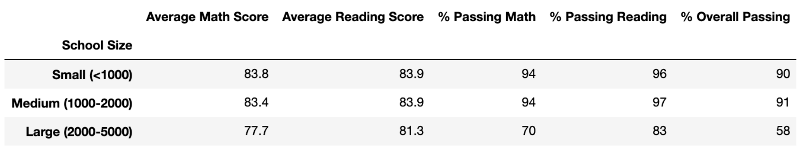
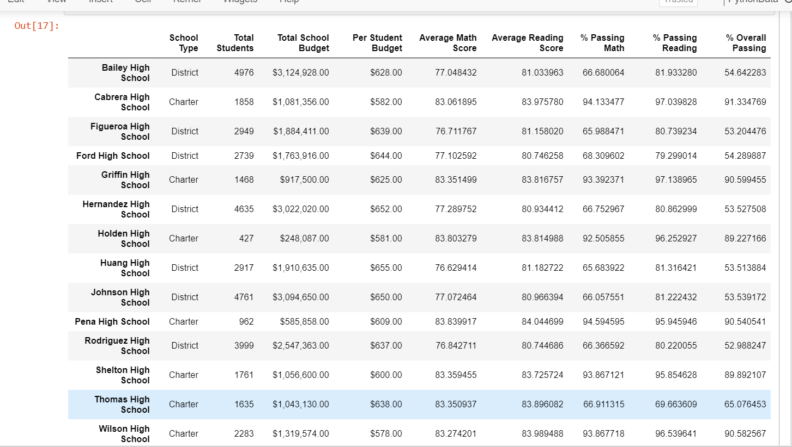
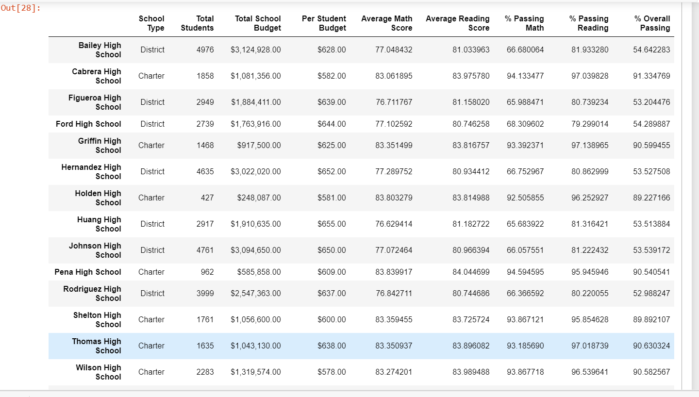
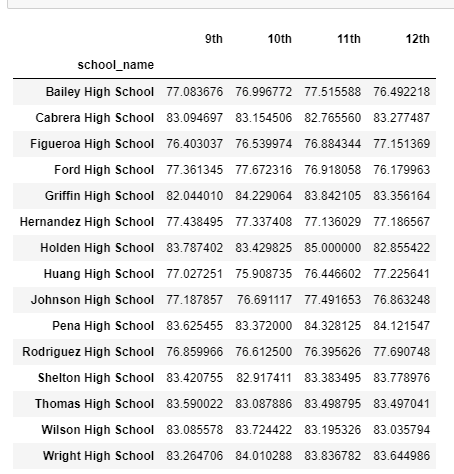
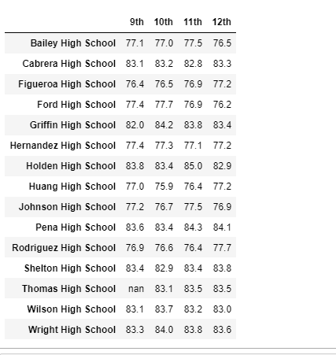
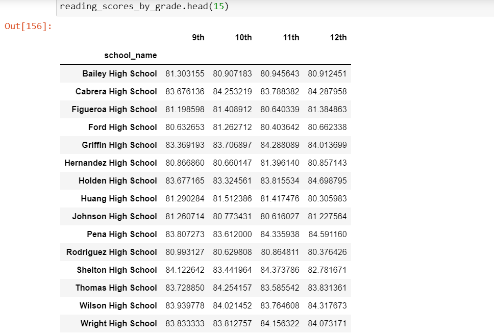
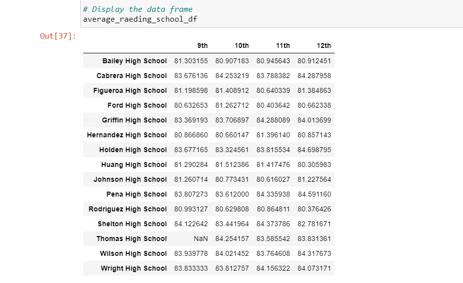
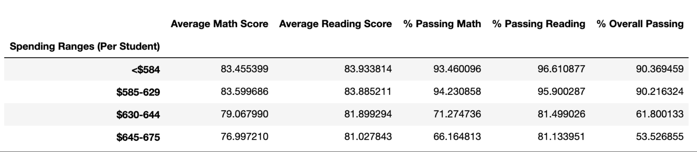

# School District Analysis

## Overview of the school district analysis
Maria is tasked with preparing all standardized test data for analysis, reporting, and presentation to provide insight about performance trends and patterns. The task is to aggregate the data and showcase trends in school performance. this analysis will assist the school board and superintendent in making decisions regarding the school budget and priorities. 
after the first report the school board has notified Maria and her supervisor that the analysis file shows evidence of academic dishonesty; specifically, reading and math grades for Thomas High School ninth graders appear to have been altered. Although the school board does not know the full extent of the academic dishonesty, they want to uphold state-testing standards and have turned to Maria for help. We are asked to replace the math and reading scores for Thomas High School with NaNs while keeping the rest of the data intact. Once we’ve replaced the math and reading scores, we would repeat the school district analysis that we did and write up a report to describe how these changes affected the overall analysis.

## Results:

How is the district summary affected?

*Figure 1:* District before change 

*Figure 2:* District after change 

How is the school summary affected?

*Figure 3:* School size before change

*Figure 4:* School size after change

How does replacing the ninth graders’ math and reading scores affect Thomas High School’s performance relative to the other schools?

*Figure 5:*

*Figure 6:*

How does replacing the ninth-grade scores affect the following:

Math and reading scores by grade

*Figure 7:*

*Figure 8:*

*Figure 9:*

*Figure 10:*

Scores by school spending

*Figure 11:*

